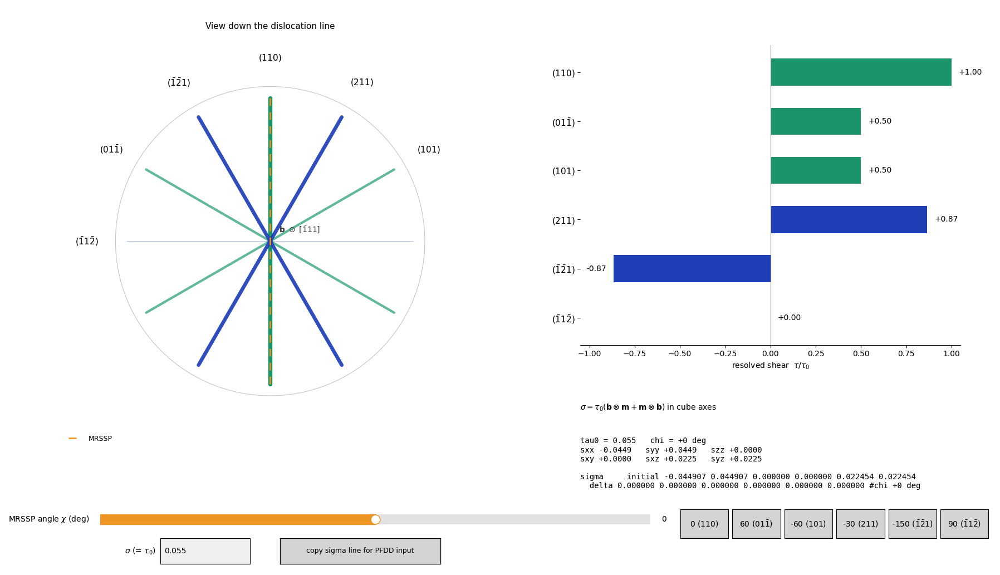

# PFDD MRSSP GUI

An interactive matplotlib tool for constructing and visualizing applied
stress states for BCC screw dislocation simulations. It generates the pure
shear couple

σ = τ₀ (**b** ⊗ **m** + **m** ⊗ **b**)

for an arbitrary orientation of the maximum resolved shear stress plane
(MRSSP), expresses it in cube axes, and writes the result in the
`sigma initial ... delta ...` input-line format used by the simulation code
(e.g. phase-field dislocation dynamics).



## What it shows

The view looks down the dislocation line of a ⟨111⟩ screw dislocation with
Burgers vector **b** ∥ [1̄11]. Every slip plane of the [1̄11] zone contains
**b**, so each appears as a trace (a line through the origin). The GUI
displays all six distinct planes of the zone:

| Plane | Family | θ from (110) |
| --- | --- | --- |
| (110) | {110} | 0° |
| (011̄) | {110} | +60° |
| (101) | {110} | −60° |
| (211) | {112} | −30° |
| (1̄2̄1) | {112} | −150° |
| (1̄12̄) | {112} | +90° |

Dragging the χ slider rotates the MRSSP (dashed line) about **b** and
updates, in real time:

- the resolved shear τ/τ₀ = cos(θ − χ) on every plane (bar chart and
  trace weighting), making the geometric identity between the {110}
  shears and the twinning/antitwinning asymmetry of the {112} planes
  directly visible;
- the six independent components of the applied stress tensor in cube
  axes, i.e. exactly the numbers the simulation input file needs.

Because the applied state is a pure shear couple, it carries **zero
Escaig shear, zero normal stress on every plane of the zone, and zero
hydrostatic pressure** — the diagonal components that appear in the cube
frame are the same pure shear viewed off-axis. This makes it the clean
loading for isolating the χ-dependence of glide, in contrast to e.g.
uniaxial loading, which introduces non-glide stress components.

## Features

- χ slider covering the full −180° … 180° range, with one preset button
  per plane (labelled with Miller indices).
- Editable σ (= τ₀) magnitude.
- **Copy sigma line** button: puts the complete
  `sigma initial <6 components> delta <6 components> #chi <angle>` line on
  the clipboard, ready to paste into a simulation input file. The line is
  also echoed to the terminal.
- Window opens scaled to the current screen (~72% of screen width,
  aspect-preserving), so it looks the same on a laptop and an external
  monitor.

## Installation

Requires Python 3 with:

```bash
pip install numpy matplotlib
```

Optional (quality of life):

```bash
pip install pyperclip    # most robust clipboard support
pip install screeninfo   # cross-platform screen-size detection
```

On macOS neither is strictly needed: the clipboard falls back to the
native `pbcopy`, and the screen size is read via CoreGraphics.

## Usage

```bash
python pfdd_mrssp_gui.py
```

Set χ with the slider or a preset button, set the stress magnitude in the
σ box (press Enter), and click **copy sigma line**.

The geometry functions are also importable for scripted use:

```python
from pfdd_mrssp_gui import stress_tensor, mrssp_normal, resolved_shear, state

state["tau0"] = 0.055
S = stress_tensor(chi_deg=-30)   # cube-axis tensor, MRSSP on (211)
```

## Conventions

- **b** = [1̄11]/√3; χ is measured about **b** from the (110) normal,
  positive toward **b** × **n**₍₁₁₀₎.
- Reversing a plane normal flips the sign of the applied shear. For {112}
  planes this is physically meaningful (twinning vs. antitwinning sense);
  check the sense against your simulation geometry before comparing
  critical stresses.
- Output components are ordered σxx σyy σzz σxy σxz σyz, in the same
  units as the entered magnitude (e.g. units of the shear modulus).

## Extending

- Add or remove planes by editing the `PLANES` list (angle, mathtext
  label, family); the bar chart, traces, and preset buttons are generated
  from it.
- Colors live in the `COL` dictionary (`"110"`, `"112"`, `"mrssp"`).

## Requirements

- Python ≥ 3.8, numpy, matplotlib ≥ 3.5 recommended.
- Tested on macOS (native `macosx` backend) and Linux.
